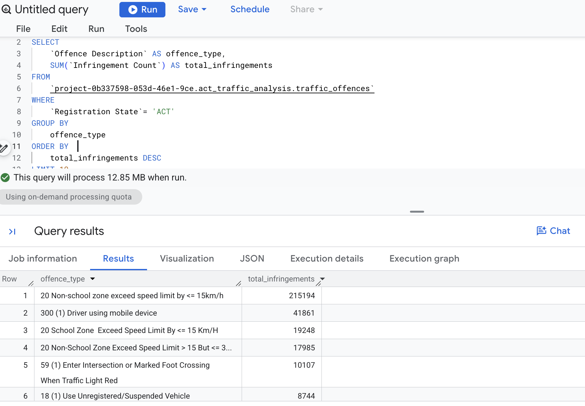
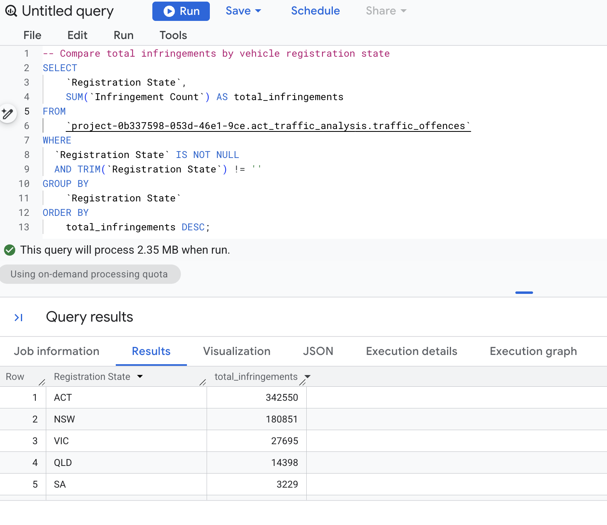

# ACT-Traffic-and-Camera-Offences-SQL-Analysis

A beginner SQL project using Google BigQuery to analyse ACT traffic infringements, penalty amounts, offence types and missing data.

## Project Overview

This SQL project analyses traffic and camera offence data published by the ACT Government Open Data Portal dataACT. 

Google BigQuery was used to calculate infringement totals, compare categories, identify common offences and check important columns for missing values.

## Project Objective

The objective is to identify where traffic infringements and penalty amounts are concentrated and provide a clear overview of the most commonly recorded offences.

## Business Questions

The analysis addresses the following questions:

1. How many records, infringements and total penalty amounts are included in the dataset?
2. How do infringements and penalty amounts differ by client type?
3. Are there missing values in important columns?
4. Which vehicle registration states recorded the most infringements on ACT roads?
5. Which offence descriptions recorded the highest number of infringements?
6. Which camera locations generated the highest total penalty amounts?
7. What were the most common offences recorded for ACT-registered vehicles?

## Dataset

* **Source:** (https://www.data.act.gov.au/Transport/Traffic-and-Camera-Offences-and-Fines/vr9h-djj8/about_data)
* **Primary tool:** Google BigQuery

The main columns used were:

* `Registration State`
* `Client Type`
* `Infringement Type`
* `Camera Location`
* `Offence Description`
* `Sum of Penalty Amount`
* `Infringement Count`

## SQL Skills Used

* `SELECT`
* `COUNT`
* `SUM`
* `COUNTIF`
* `WHERE`
* `GROUP BY`
* `ORDER BY`
* `LIMIT`
* `IF`
* `COALESCE`
* `TRIM`
* `IS NULL`
* Column aliases
* Filtering
* Missing-value handling

## Project Process

**1. The first query was used to calculate, total dataset rows, total infringements and total penalty amount.**

The dataset contained:

* 189,709 records
* 572,315 infringements
* $261,370,801 in total penalty amounts

**2. The second query grouped the data by client type and calculated the total infringements and penalty amounts for each group.**

Missing client-type values were replaced with UNKNOWN using IF and COALESCE.

The PRSN client type recorded the majority of infringements with the total penalty amount of $198,502,849.

**3. The third query checked for missing or blank values in the dataset.**

The query used COUNTIF, COALESCE and TRIM to identify missing client types, camera locations, registration state and penalty amounts.

**4. The fourth query grouped the vehicle registration states by the numebr of total traffic infringements.**

ACT-registered vehicles recorded the highest number of infringements, followed by NSW-registered vehicles.

**5. In the fifth query, the offence descriptions were grouped and ordered by total infringement count.**

The most frequently recorded offence was:

20 Non-school zone exceed speed limit by ≤ 15 km/h

This offence recorded approximately 391,443 infringements, making it the largest offence category in the dataset.

**6. In the sixth query, camera locations were grouped by total penalty amount.**

Camera location 1002 recorded approximately 101,159 infringements.

This was the highest total penalty amount among the camera locations included in the analysis.

**7. The final query filtered the dataset to include only ACT-registered vehicles.**

The results were then grouped by offence description to identify the top 10 offences for
ACT-registered vehicles which determined the most common offence was:

20 Non-school zone exceed speed limit by ≤ 15 km/h

This offence recorded approximately 215,194 infringements involving ACT-registered vehicles.

**All completed queries are available in the [SQL analysis file](act_traffic_offences_analysis.sql).**

### Top 10 Offence Descriptions

### Registration State Comparison

## Key Findings

* The dataset contained **572,315 infringements** and approximately **$261.4 million** in penalty amounts.
* The `PRSN` client type recorded the majority of infringements.
* ACT-registered vehicles recorded the highest number of infringements of **342,550**, followed by NSW-registered vehicles of **180,851**.
* Non-school-zone speeding was the most commonly recorded offence.
* The same speeding offence was also the most common offence for ACT-registered vehicles.
* Camera location `1002` recorded the highest total penalty amount among locations with available camera codes.
* Camera location had the highest number of missing values among the fields checked.

## Excel Analysis

The top 10 offence-description results were exported from BigQuery into Microsoft Excel.

The exported data was:

* Formatted as an Excel Table
* Checked for readable headings and number formatting
* Presented using a horizontal bar chart

A horizontal bar chart was selected because the offence descriptions were long and easier to compare in this format.

The Excel workbook containing the exported results is available in the repository.

## Recommendations

1. Prioritising low-level speeding prevention, as non-school-zone speeding by 15 km/h or less was the most frequently recorded offence.
2. Targeting road-safety communication toward ACT and NSW drivers, as vehicles registered in these two jurisdictions accounted for most recorded infringements.
3.  Reviewing high-penalty camera locations, particularly camera location 1002, to understand whether the result is related to traffic volume, camera operating time or recurring driver behaviour.
4. Improving data completeness, especially for camera location and client type, to support more reliable future analysis.
5. Linking camera identification codes to readable street or intersection names so that high-risk locations can be more easily understood and communicated.

## Limitations

* Some client types, registration states, camera locations and penalty amounts were missing.
* Camera locations are represented by identification codes rather than readable location names.
* The analysis identifies patterns but does not explain why the offences occurred.

## Conclusion

This beginner project demonstrates my ability to use foundational SQL skills to explore a public dataset, calculate totals, group categories, filter records, handle missing values and identify useful patterns.

It also demonstrates how SQL results can be exported into Excel and presented through a simple visualisation.

## Author

**Sammy Rana**

Data enthusiast developing practical skills in Excel, SQL and data visualisation.
